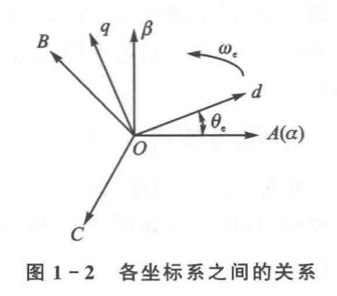
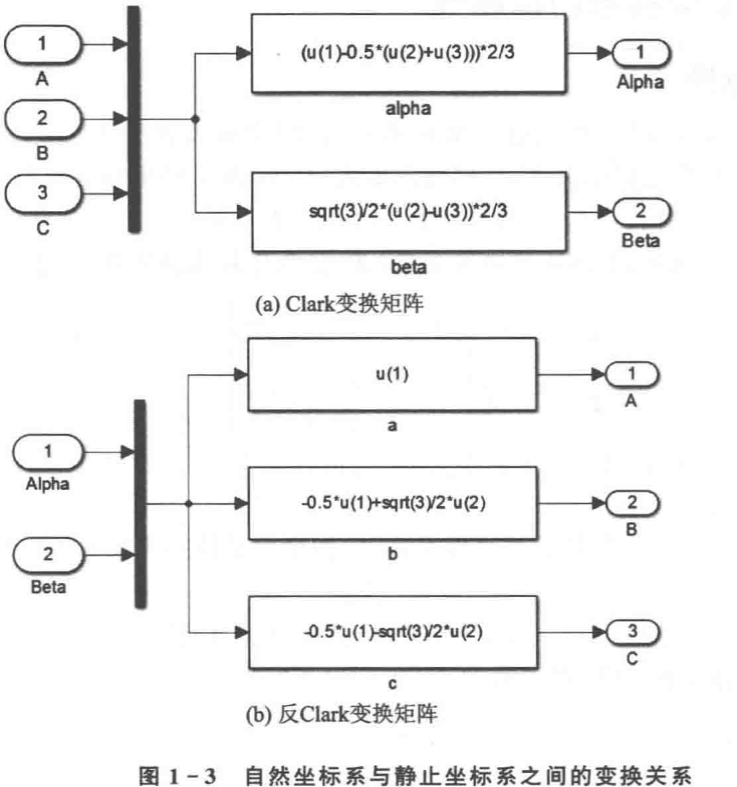

# 现代永磁同步电机控制原理及MATLAB仿真笔记

## 笔记说明

- 参考书目： 《现代永磁同步电机控制原理及MATLAB仿真》
- 测试版本： Matlab R2025b

请使用**Typora或Vscode等软件打开此文件**，在github直接浏览可能会出现部分公式乱码

## 三相PMSM的基本数学模型

假设三相PMSM为理想电机，且满足下列条件：

1. 忽略电机铁芯的饱和。
2. 不计电机中的涡流和磁滞损耗。
3. 电机中的电流为对称的三相正弦波电流。

在**自然坐标系**下，三相PMSM的电压方程为：

$$
u_{3s} = R i_{3s} + \frac{d}{dt} \Psi_{3s}
$$

磁链方程为

$$
\Psi_{3s} = L_{3s} i_{3s} + \psi_f \cdot F_{3s}(\theta_e)
$$

其中

- $\Psi_{3s}$：三相绕组的磁链向量
- $u_{3s}$：三相绕组的相电压向量
- $i_{3s}$：三相绕组的相电流向量
- $R$：每相绕组的电阻
- $L_{3s}$：三相绕组的电感矩阵
- $ F_{3s}(\theta_e)$：三相绕组的磁链分布函数

且满足

$$
\mathbf{i}_{3s} =
\begin{bmatrix}
i_A \\
i_B \\
i_C
\end{bmatrix}
$$

$$
\mathbf{R}_{3s} =
\begin{bmatrix}
R & 0 & 0 \\
0 & R & 0 \\
0 & 0 & R
\end{bmatrix}
$$

$$
\mathbf{\Psi}_{3s} =
\begin{bmatrix}
\psi_A \\
\psi_B \\
\psi_C
\end{bmatrix}
$$

$$
\mathbf{u}_{3s} =
\begin{bmatrix}
u_A \\
u_B \\
u_C
\end{bmatrix}
$$

$$
\mathbf{F}_{3s}(\theta_{e}) =
\begin{bmatrix}
sin(\theta_{e}) \\
sin(\theta_e - 2 \pi / 3) \\
sin(\theta_e + 2 \pi /3)
\end{bmatrix}
$$

$$
\mathbf{L}_{3s} =
L_{m3}\begin{bmatrix}
1 & cos2\pi/3 & cos4\pi/3 \\
cos2\pi/3 & 1 & cos2\pi/3 \\
cos4\pi/3 & cos2\pi/3 & 1
\end{bmatrix}
+
L_{l3}\begin{bmatrix}
1 & 0 & 0 \\
0 & 1 & 0 \\
0 & 0 & 1
\end{bmatrix}
$$

其中

- $L_{m3}$ : 定子互感
- $L_{l3}$ : 定子漏感

电磁转矩$T_{e}$等于磁场储能对机械角$\theta_{m}$位移的偏导

$$
T_{e} =
\frac{1}{2} p_{n}
\frac{\partial}{\partial \theta_{m}}
(\mathbf{i}_{3s}^{T} \cdot \mathbf{\Psi_{3s}})
$$

其中

- $p_{n}$ : 三相PMSM的极对数

电机的机械运动方程

$$
J \frac{d\omega_{m}}{dt} =
T_{e} - T_{L} - B\omega_{m}
$$

其中

- $\omega_{m}$ : 电机的机械角速度
- $J$ : 转动惯量
- $B$ : 阻尼系数
- $T_{L}$ : 负载转矩

## 三相PMSM的坐标变换

三种坐标系关系总结表

| 坐标系名称 | 常用符号 | 坐标轴定义 | 是否旋转 | 参考对象 | 主要作用 | 工程特点 |
| ------- | ----- | ----------------------- | ---- | ---- | ------------ | ------------------- |
| 自然坐标系 | A-B-C | 三相定子绕组物理轴，彼此相差 120° 电角度 | 否 | 定子 | 电机真实物理量表示 | 变量强耦合，正弦量多，不利于控制 |
| 静止坐标系 | α-β | α 轴通常与 A 相重合，β 轴与 α 正交 | 否 | 定子 | 空间矢量表示、SVPWM | 三相降维为二维，结构清晰但仍随时间变化 |
| 同步旋转坐标系 | d-q | d 轴与转子磁场方向一致，q 轴与 d 正交 | 是 | 转子磁场 | 控制器设计（FOC） | 稳态量为常数，可实现转矩与磁链解耦 |

坐标系之间的变换关系

| 变换名称 | 变换方向 | 作用说明 | 本质含义 |
| ----------- | -------- | ---------------- | ------------- |
| Clarke 变换 | ABC → αβ | 将三相系统映射到二维正交平面 | 三相空间矢量合成 |
| Park 变换 | αβ → dq | 将旋转矢量变为同步坐标下的直流量 | 选择随磁场旋转的观察坐标系 |
| 反 Park 变换 | dq → αβ | 将控制量还原到静止坐标系 | 从控制世界回到物理世界 |
| 反 Clarke 变换 | αβ → ABC | 生成三相参考量 | 为逆变器与电机服务 |

### Clark变换与仿真建模

坐标变换公式

$$
\begin{bmatrix}
f_{\alpha} & f_{\beta} & f_{0}
\end{bmatrix}^T
=
T_{3s/2s}\begin{bmatrix}
f_{A} & f_{B} & f_{C}
\end{bmatrix}^T
$$

其中

- $f$ : 电机的电压电流或磁链等变量
- $T_{3s/2s}$ : 坐标变换矩阵

坐标变换矩阵可表示为

$$
T_{3s/2s}
=
\frac{2}{3}
\begin{bmatrix}
1 & -\frac{1}{2} & -\frac{1}{2} \\
0 & \frac{\sqrt{3}}{2} & -\frac{\sqrt{3}}{2} \\
\frac{\sqrt{2}}{2} & \frac{\sqrt{2}}{2} & \frac{\sqrt{2}}{2}
\end{bmatrix}
$$

将静止坐标系$\alpha-\beta$变换到自然坐标系$ABC$的坐标变换成为反Clark变换，表示为

$$
\begin{bmatrix}
f_{A} & f_{B} & f_{C}
\end{bmatrix}^T
=
T_{2s/3s}\begin{bmatrix}
f_{\alpha} & f_{\beta} & f_{0}
\end{bmatrix}^T
$$

坐标变换矩阵可表示为
$$
T_{2s/3s}
=
T_{3s/2s}^{-1}
=
\frac{2}{3}
\begin{bmatrix}
1 & 0 & \frac{\sqrt{2}}{2} \\
-\frac{1}{2} & \frac{\sqrt{3}}{2} & \frac{\sqrt{2}}{2} \\
-\frac{1}{2} & -\frac{\sqrt{3}}{2} & \frac{\sqrt{2}}{2}
\end{bmatrix}
$$

- 当采用幅值不变作为约束条件时，变换矩阵前的系数为$\frac{2}{3}$
- 当采用功率不变作为约束条件式，变换矩阵前的系数为$\sqrt{\frac{2}{3}}$

Clark变换仿真建模：

- Clark变换仿真建模在 `\Librarys\MyPMSMLibrary.slx\Transforms\Clark_Transform`
- Clark变换仿真测试模型在 `\models\tests\Clark_Test.slx`
- Clark变换仿真测试脚本在 `\models\tests\test_Clark.m`
- 反Clark变换仿真建模在`\Librarys\MyPMSMLibrary.slx\Transforms\InClark_Transform`
- 反Clark变换仿真测试模型在 `\models\tests\InClark_Test.slx`
- 反Clark变换仿真测试脚本在 `\models\tests\test_InClark.m`
