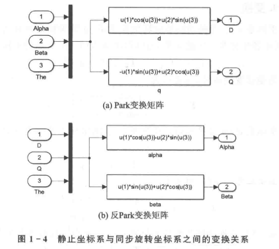
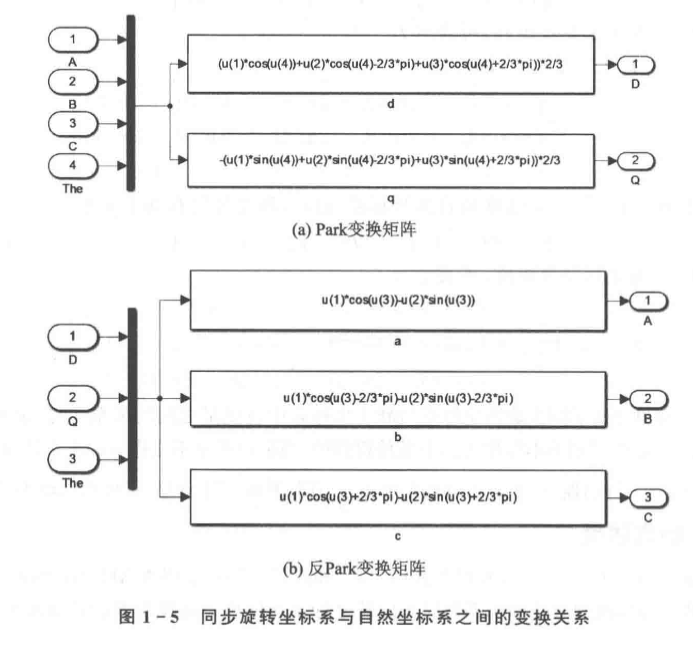
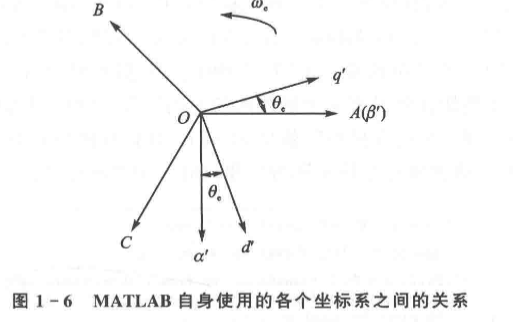
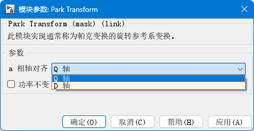
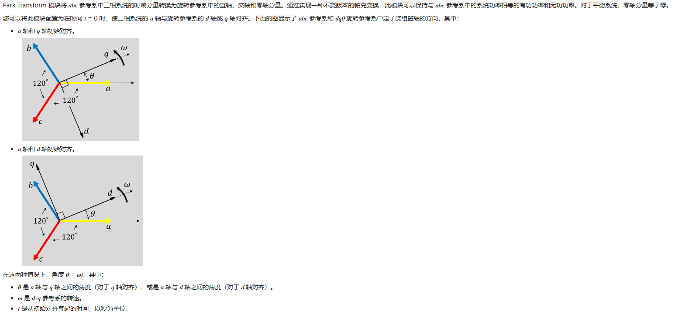
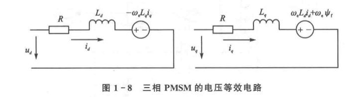
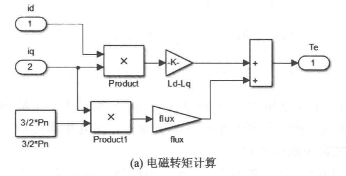

# 现代永磁同步电机控制原理及MATLAB仿真笔记

## 笔记说明

- 参考书目： 《现代永磁同步电机控制原理及MATLAB仿真》
- 测试版本： Matlab R2025b

请使用**Typora或Vscode等软件打开此文件**，在github直接浏览可能会出现部分公式乱码

## 三相PMSM的基本数学模型

假设三相PMSM为理想电机，且满足下列条件：

1. 忽略电机铁芯的饱和。
2. 不计电机中的涡流和磁滞损耗。
3. 电机中的电流为对称的三相正弦波电流。

在**自然坐标系**下，三相PMSM的电压方程为：

$$
u_{3s} = R i_{3s} + \frac{d}{dt} \Psi_{3s}
$$

磁链方程为

$$
\Psi_{3s} = L_{3s} i_{3s} + \psi_f \cdot F_{3s}(\theta_e)
$$

其中

- $\Psi_{3s}$：三相绕组的磁链向量
- $u_{3s}$：三相绕组的相电压向量
- $i_{3s}$：三相绕组的相电流向量
- $R$：每相绕组的电阻
- $L_{3s}$：三相绕组的电感矩阵
- $ F_{3s}(\theta_e)$：三相绕组的磁链分布函数

且满足

$$
\mathbf{i}_{3s} =
\begin{bmatrix}
i_A \\
i_B \\
i_C
\end{bmatrix}
$$

$$
\mathbf{R}_{3s} =
\begin{bmatrix}
R & 0 & 0 \\
0 & R & 0 \\
0 & 0 & R
\end{bmatrix}
$$

$$
\mathbf{\Psi}_{3s} =
\begin{bmatrix}
\psi_A \\
\psi_B \\
\psi_C
\end{bmatrix}
$$

$$
\mathbf{u}_{3s} =
\begin{bmatrix}
u_A \\
u_B \\
u_C
\end{bmatrix}
$$

$$
\mathbf{F}_{3s}(\theta_{e}) =
\begin{bmatrix}
sin(\theta_{e}) \\
sin(\theta_e - 2 \pi / 3) \\
sin(\theta_e + 2 \pi /3)
\end{bmatrix}
$$

$$
\mathbf{L}_{3s} =
L_{m3}\begin{bmatrix}
1 & cos2\pi/3 & cos4\pi/3 \\
cos2\pi/3 & 1 & cos2\pi/3 \\
cos4\pi/3 & cos2\pi/3 & 1
\end{bmatrix}
+
L_{l3}\begin{bmatrix}
1 & 0 & 0 \\
0 & 1 & 0 \\
0 & 0 & 1
\end{bmatrix}
$$

其中

- $L_{m3}$ : 定子互感
- $L_{l3}$ : 定子漏感

电磁转矩 $T_{e}$ 等于磁场储能对机械角 $\theta_{m}$ 位移的偏导

$$
T_{e} =
\frac{1}{2} p_{n}
\frac{\partial}{\partial \theta_{m}}
(\mathbf{i}_{3s}^{T} \cdot \mathbf{\Psi_{3s}})
$$

其中

- $p_{n}$ : 三相PMSM的极对数

电机的机械运动方程

$$
J \frac{d\omega_{m}}{dt} =
T_{e} - T_{L} - B\omega_{m}
$$

其中

- $\omega_{m}$ : 电机的机械角速度
- $J$ : 转动惯量
- $B$ : 阻尼系数
- $T_{L}$ : 负载转矩

## 三相PMSM的坐标变换

三种坐标系关系总结表

| 坐标系名称 | 常用符号 | 坐标轴定义 | 是否旋转 | 参考对象 | 主要作用 | 工程特点 |
| ------- | ----- | ----------------------- | ---- | ---- | ------------ | ------------------- |
| 自然坐标系 | A-B-C | 三相定子绕组物理轴，彼此相差 120° 电角度 | 否 | 定子 | 电机真实物理量表示 | 变量强耦合，正弦量多，不利于控制 |
| 静止坐标系 | α-β | α 轴通常与 A 相重合，β 轴与 α 正交 | 否 | 定子 | 空间矢量表示、SVPWM | 三相降维为二维，结构清晰但仍随时间变化 |
| 同步旋转坐标系 | d-q | d 轴与转子磁场方向一致，q 轴与 d 正交 | 是 | 转子磁场 | 控制器设计（FOC） | 稳态量为常数，可实现转矩与磁链解耦 |

坐标系之间的变换关系

| 变换名称 | 变换方向 | 作用说明 | 本质含义 |
| ----------- | -------- | ---------------- | ------------- |
| Clarke 变换 | ABC → αβ | 将三相系统映射到二维正交平面 | 三相空间矢量合成 |
| Park 变换 | αβ → dq | 将旋转矢量变为同步坐标下的直流量 | 选择随磁场旋转的观察坐标系 |
| 反 Park 变换 | dq → αβ | 将控制量还原到静止坐标系 | 从控制世界回到物理世界 |
| 反 Clarke 变换 | αβ → ABC | 生成三相参考量 | 为逆变器与电机服务 |

### Clark变换与仿真建模

Clark变换公式为

$$
\begin{bmatrix}
f_{\alpha} & f_{\beta} & f_{0}
\end{bmatrix}^T=
T_{3s/2s}
\begin{bmatrix}
f_{A} & f_{B} & f_{C}
\end{bmatrix}^T
$$

其中

- $f$ : 电机的电压电流或磁链等变量
- $T_{3s/2s}$ : 坐标变换矩阵

坐标变换矩阵可表示为

$$
T_{3s/2s}=
\frac{2}{3}
\begin{bmatrix}
1 & -\frac{1}{2} & -\frac{1}{2} \\
0 & \frac{\sqrt{3}}{2} & -\frac{\sqrt{3}}{2} \\
\frac{\sqrt{2}}{2} & \frac{\sqrt{2}}{2} & \frac{\sqrt{2}}{2}
\end{bmatrix}
$$

将静止坐标系 $\alpha-\beta$ 变换到自然坐标系 $ABC$ 的坐标变换成为反Clark变换，表示为

$$
\begin{bmatrix}
f_{A} & f_{B} & f_{C}
\end{bmatrix}^T=
T_{2s/3s}\begin{bmatrix}
f_{\alpha} & f_{\beta} & f_{0}
\end{bmatrix}^T
$$

坐标变换矩阵可表示为

$$
T_{2s/3s}=
T_{3s/2s}^{-1}=
\frac{2}{3}
\begin{bmatrix}
1 & 0 & \frac{\sqrt{2}}{2} \\
-\frac{1}{2} & \frac{\sqrt{3}}{2} & \frac{\sqrt{2}}{2} \\
-\frac{1}{2} & -\frac{\sqrt{3}}{2} & \frac{\sqrt{2}}{2}
\end{bmatrix}
$$

- 当采用幅值不变作为约束条件时，变换矩阵前的系数为 $\frac{2}{3}$
- 当采用功率不变作为约束条件式，变换矩阵前的系数为 $\sqrt{\frac{2}{3}}$

Clark变换仿真建模：

- Clark变换仿真建模在 `\Librarys\MyPMSMLibrary.slx\Transforms\Clark_Transform`
- Clark变换仿真测试模型在 `\models\tests\Clark_Test.slx`
- Clark变换仿真测试脚本在 `\models\tests\test_Clark.m`
- 反Clark变换仿真建模在`\Librarys\MyPMSMLibrary.slx\Transforms\InClark_Transform`
- 反Clark变换仿真测试模型在 `\models\tests\InClark_Test.slx`
- 反Clark变换仿真测试脚本在 `\models\tests\test_InClark.m`

### Park变换与仿真建模

将静止坐标系 $\alpha-\beta$ 变换到同步坐标系 $dq$ 的坐标变换成为Park变换，变换公式为

$$
\begin{bmatrix}
f_{d} & f_{q}
\end{bmatrix}^T=
T_{2s/2r}
\begin{bmatrix}
f_{\alpha} & f_{\beta}
\end{bmatrix}^T
$$

其中 $T_{2s/2r}$ 为变换矩阵，可表示为

$$
T_{2s/2r}=
\begin{bmatrix}
cos\theta_{e} & sin\theta_{e} \\
-sin\theta_{e} & cos\theta_{e}
\end{bmatrix}
$$

将同步坐标系 $dq$ 变换到静止坐标系 $\alpha-\beta$ 的坐标变换成为反Park变换，表示为

$$
\begin{bmatrix}
f_{\alpha} & f_{\beta}
\end{bmatrix}^T=
T_{2r/2s}
\begin{bmatrix}
f_{d} & f_{q}
\end{bmatrix}^T
$$

其中 $T_{2r/2s}$ 为变换矩阵，可表示为

$$
T_{2r/2s}=
T_{2s/2r}^{-1}=
\begin{bmatrix}
cos\theta_{e} & -sin\theta_{e} \\
sin\theta_{e} & cos\theta_{e}
\end{bmatrix}
$$

将自然坐标系 $ABC$ 直接变换到同步坐标系 $dq$ 的坐标变换成为Clark-Park变换，变换公式为

$$
\begin{bmatrix}
f_{d} & f_{q} & f_{0}
\end{bmatrix}^T=
T_{3s/2r}
\begin{bmatrix}
f_{A} & f_{B} & f_{C}
\end{bmatrix}^T
$$

其中 $T_{3s/2r}$ 为变换矩阵，可表示为

$$
T_{3s/2r}=
T_{3s/2s} \cdot T_{2s/2r}=
\frac{2}{3}
\begin{bmatrix}
cos\theta_{e} & cos(\theta_{e} - 2\pi/3) & cos(\theta_{e} + 2\pi/3) \\
-sin\theta_{e} & -sin(\theta_{e} - 2\pi/3) & -sin(\theta_{e} + 2\pi/3) \\
\frac{1}{2} & \frac{1}{2} & \frac{1}{2}
\end{bmatrix}
$$

将同步坐标系 $dq$ 直接变换到自然坐标系 $ABC$ 的坐标变换成为反Clark-Park变换，表示为

$$
\begin{bmatrix}
f_{A} & f_{B} & f_{C}
\end{bmatrix}^T=
T_{2r/3s}
\begin{bmatrix}
f_{d} & f_{q} & f_{0}
\end{bmatrix}^T
$$

其中 $T_{2r/3s}$ 为变换矩阵，可表示为

$$
T_{2r/3s}=
T_{3s/2r}^{-1}=
\frac{2}{3}
\begin{bmatrix}
cos\theta_{e} & -sin\theta_{e} & \frac{1}{2} \\
cos(\theta_{e} - 2\pi/3) & -sin(\theta_{e} - 2\pi/3) & \frac{1}{2} \\
cos(\theta_{e} + 2\pi/3) & -sin(\theta_{e} + 2\pi/3) & \frac{1}{2}
\end{bmatrix}
$$

- 当采用幅值不变作为约束条件时，变换矩阵前的系数为 $\frac{2}{3}$
- 当采用功率不变作为约束条件式，变换矩阵前的系数为 $\sqrt{\frac{2}{3}}$
- 对于三相对称系统而言，在计算时零序向量 $f_{0}$ 恒为零，可省略不计

Park变换仿真建模：

- Park变换仿真建模在 `\Librarys\MyPMSMLibrary.slx\Transforms\Park_Transform`
- Park变换仿真测试模型在 `\models\tests\Park_Test.slx`
- Park变换仿真测试脚本在 `\models\tests\test_Park.m`
- 反Park变换仿真建模在`\Librarys\MyPMSMLibrary.slx\Transforms\InPark_Transform`
- 反Park变换仿真测试模型在 `\models\tests\InPark_Test.slx`
- 反Park变换仿真测试脚本在 `\models\tests\test_InPark.m`

Clark-Park变换仿真建模：

- Clark-Park变换仿真建模在 `\Librarys\MyPMSMLibrary.slx\Transforms\ClarkPark_Transform`
- Clark-Park变换仿真测试模型在 `\models\tests\ClarkPark_Test.slx`
- Clark-Park变换仿真测试脚本在 `\models\tests\test_ClarkPark.m`
- 反Clark-Park变换仿真建模在`\Librarys\MyPMSMLibrary.slx\Transforms\InClarkPark_Transform`
- 反Clark-Park变换仿真测试模型在 `\models\tests\InClarkPark_Test.slx`
- 反Clark-Park变换仿真测试脚本在 `\models\tests\test_InClarkPark.m`

### 两种常用坐标系之间的关系

这本书中所用的坐标系和MATLAB自带的坐标系定义略有不同，具体关系如下：

- 当选择a轴和q轴初始对齐时，MATLAB 使用是图1-6的分布与本书不同
- 当选择a轴和d轴初始对齐时，MATLAB 使用的是与本书相同的分布

## 同步旋转坐标系下的数学建模

### 数学建模

在同步旋转坐标系d-q下的数学模型，其定子电压方程可表示为：

$$
u_{d} = R i_{d} + \frac{d\psi_{d}}{dt} - \omega_{e} \psi_q \\
u_{q} = R i_{q} + \frac{d\psi_{q}}{dt} + \omega_{e} \psi_d
$$

定子磁链方程为

$$
\psi_{d} = L_{d} i_{d} + \psi_{f} \\
\psi_{q} = L_{q} i_{q}
$$

将定子磁链方程带入定子电压方程可得

$$
u_{d} = R i_{d} + L_{d} \frac{d i_{d}}{dt} - \omega_{e} L_{q} i_{q} \\
u_{q} = R i_{q} + L_{q} \frac{d i_{q}}{dt} + \omega_{e} L_{d} i_{d} + \omega_{e} \psi_{f}
$$

其中

- $u_{d}, u_{q}$ : 定子d轴和q轴电压
- $i_{d}, i_{q}$ : 定子d轴和q轴电流
- $\psi_{d}, \psi_{q}$ : 定子d轴和q轴磁链
- $L_{d}, L_{q}$ : 定子d轴和q轴电感
- $\omega_{e}$ : 电机电角速度
- $\psi_{f}$ : 永磁体磁链

电压等效电路如下，三相PMSM的数学模型实现了完全的解耦

此时电磁转矩方程为

$$
T_{e} = \frac{3}{2} p_{n} i_{q} [i_d (L_{d} - L_{q}) + \psi_{f}]
$$

对于表贴式三相PMSM，定子电感满足 $L_{d} = L_{q} = L_{s}$，电磁转矩方程简化为 $T_{e} = \frac{3}{2} p_{n} \psi_{f} i_{q}$

另外，在仿真建模时也需要注意

$$
\omega_{e} = p_{n} \omega_{m}
$$

其中

- $\omega_{m}$ : 电机机械角速度
- $p_{n}$ : 电机极对数
- $\omega_{e}$ : 电机电角速度

这个公式表示电机的电角速度是机械角速度的 $p_{n}$ 倍，因为每转动一圈，电机的电角度会经历 $p_{n}$ 个周期。

$$
\N_r = \frac{60 \omega_{m}}{2 \pi}
$$

其中

- $\N_r$ : 电机机械转速（单位：rpm）
- $\omega_{m}$ : 电机机械角速度（单位：rad/s）

这个公式用来将电机的机械角速度转换为机械转速，单位为每分钟转数（rpm）。

$$
\theta_{e} = \int \omega_{e} dt
$$

其中

- $\theta_{e}$ : 电角度，单位为弧度(rad)，描述电机的电角位置。
- $\omega_{e}$ : 电机电角速度，单位为弧度每秒(rad/s)，表示电机电角位置变化的速率。

这个公式表示电机的电角度是电角速度对时间的积分，反映了电机电角位置随时间的变化情况。

### 仿真建模

- 同步旋转坐标系下的电磁转矩计算仿真模型在 `\Librarys\MyPMSMLibrary.slx\ModerModel\ElecTorqueCalculation`
- 同步旋转坐标系下的电磁转矩计算测试模型在 `\models\tests\ElecTorqueCalculation_Test.slx`
- 同步旋转坐标系下的电磁转矩计算测试脚本在 `\models\tests\test_ElecTorqueCalculation.m`
